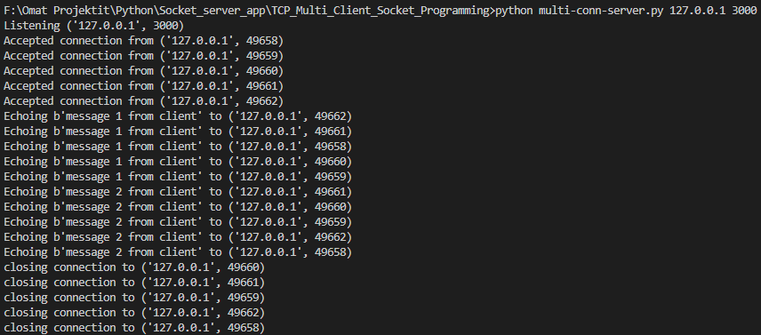
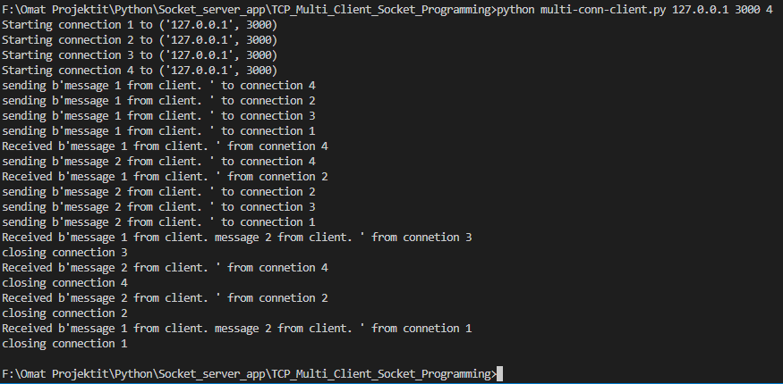

## Overview
The TCP Multi-Client Socket Programming project demonstrates how to create a server application that supports multiple client connections using TCP/IP sockets. This project provides a simple yet effective example of concurrent communication between a server and multiple clients over a network.

## Features
- **TCP Communication:** Utilizes the TCP (Transmission Control Protocol) for reliable communication between the server and clients.
- **Multi-Client Support:** Supports multiple clients connecting to the server simultaneously.
- **Socket Programming:** Demonstrates fundamental socket programming concepts in Python.

## Usage
1. **Server Setup:**
   - Run the `multi_conn_server.py` script to start the server.
   - Provide the desired host and port as command-line arguments.

    ```
    python multi_conn_server.py <host> <port>
    ```

2. **Client Setup:**
   - Run the `multi_conn_client.py` script to start a client connection.
   - Specify the server's host, port, and the number of client connections as command-line arguments.

    ```
    python multi_conn_client.py <server_host> <server_port> <num_connections>
    ```

3. **Interacting with the Server:**
   - Once the server is running and clients are connected, the server will accept and process client requests.
   - Clients can send messages to the server, and the server will echo the received messages back to the clients.

## Screenshots

<div style="display: flex; flex-wrap: wrap; justify-content: center;">
  
  
</div>

## Requirements
- Python 3.x
- No additional libraries or dependencies required.

